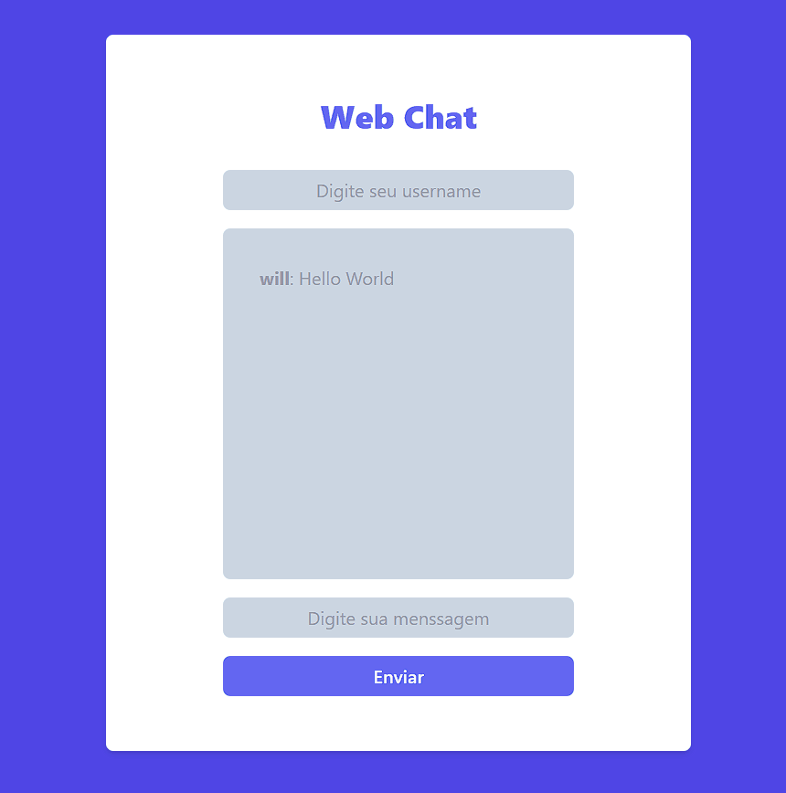

# WEB CHAT REAL TIME

## Sobre
Um web chat com comunicação em tempo real usando algumas tecnologias e frameworks.

## Imagens

<h1 align="center">
    
</h1>

#### Tecnologias

- [Express](https://expressjs.com/)
- [Socket.io](https://socket.io/)
- [TailwindCSS](https://tailwindcss.com/)

### Como usar?

Para começar você irá precisar ter instalado na sua máquina algumas ferramentas:
[Git](https://git-scm.com), [NodeJS](https://nodejs.org/en/) e também algum editor de código como
[VSCode](https://code.visualstudio.com/)

#### Abra seu git bash e cole o código abaixo:

```bash
# Para clonar o repositório:
$ git clone git@github.com:Av3z/WebChat.git

# Entre na pasta do projeto:
$ cd WebChat

# Para instalar as dependencias digite:
$ npm install

# Para iniciar o projeto:
$ npm start

# O servidor será iniciado na porta 3000, então acesse http://localhost:3000
``` 